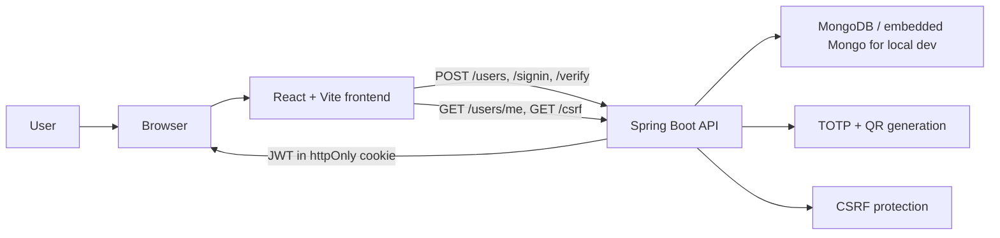

# 2-factor-authentication-demo

A full-stack demo that shows username/password sign-up and login with optional two-factor authentication, QR-code enrollment, TOTP verification, and JWT-backed browser sessions using an `httpOnly` cookie.

## Preview

_Signup, MFA enrollment, login, and protected profile access in one short walkthrough._

| Signup | MFA enrollment |
| --- | --- |
|  |  |
| Login | Profile |
|  |  |

## Table Of Contents

- [Project Snapshot](#project-snapshot)
- [What Is Implemented](#what-is-implemented)
- [Architecture](#architecture)
- [Demo Media](#demo-media)
- [Portfolio Summary](#portfolio-summary)
- [Why This Project](#why-this-project)
- [Prerequisites](#prerequisites)
- [Quick Start](#quick-start)
- [Testing](#testing)
- [Test Types](#test-types)
- [Docs](#docs)
- [Project Status](#project-status)

## Project Snapshot

- Backend: Java 21+ target, Spring Boot 4.0.6, Spring Security, MongoDB
- Frontend: React 19.2.7, Vite 8.0.16, React Router 7.16.0, Ant Design 6.4.3
- Testing: JUnit 5, Mockito, Jest 30.4.2, React Testing Library 16.3.2
- Auth: JWT in `httpOnly` cookies with CSRF protection
- MFA: TOTP with QR-code enrollment and recovery codes
- Data: MongoDB for local development

## What Is Implemented

- Sign up with username, email, password, display name, and optional MFA
- QR-code enrollment for authenticator apps
- TOTP verification during login
- One-time recovery codes for MFA-enabled accounts
- JWT-backed session access through an `httpOnly` cookie
- CSRF protection for state-changing requests
- Rate limiting for sign-in, sign-up, and MFA verification
- Logout by clearing the session cookie
- Backend and frontend tests

## Architecture

The frontend keeps the UI and auth flow lightweight, while the backend owns the security-sensitive parts:

- credential validation
- MFA enrollment and verification
- JWT issuance and cookie handling
- CSRF protection
- rate limiting

## Demo Media

Recommended screenshots or a short GIF for GitHub or interview use:

- signup screen with the MFA option visible
- QR enrollment screen with the generated code
- login flow showing the MFA verification step
- profile page with the avatar and logout button

See [`docs/demo-media.md`](docs/demo-media.md) for a small capture checklist.

## Portfolio Summary

GitHub repo description:

> Full-stack Spring Boot and React demo with optional TOTP-based MFA, QR enrollment, JWT-backed `httpOnly` cookie sessions, CSRF protection, and rate limiting.

CV bullets:

- Built a full-stack authentication demo with optional MFA, QR enrollment, JWT cookie sessions, CSRF protection, and rate limiting using Spring Boot, React, and MongoDB.
- Added recovery codes and security hardening to move the project beyond a basic tutorial implementation.
- Organized the repo with a clean README, supporting docs, and a guided demo flow for interviews and portfolio review.

## Why This Project

This project was built to demonstrate:

- a realistic full-stack auth flow
- a browser-friendly MFA experience
- practical Spring Boot and React architecture
- security tradeoffs and hardening decisions
- a repo that is easy to run and present in an interview

## Prerequisites

- Backend requires Java 21 JDK or newer.
- Frontend requires Node.js and npm.
- On Windows, you can run the `.sh` scripts from Git Bash or WSL.
- If your shell already provides the right tools, the same `.sh` scripts also work on Linux and macOS.

## Quick Start

1. Copy `backend/.env.example` to `backend/.env` and set `JWT_SECRET` to a long random string.
2. Copy `frontend/.env.example` to `frontend/.env` if you want to override the API URL.
3. Run the full backend verification flow, including unit, slice, and integration tests: `./scripts/backend-verify.sh`
4. Run the full frontend verification flow: `./scripts/frontend-verify.sh`
5. Start the backend: `./scripts/backend-run.sh`
6. Start the frontend: `./scripts/frontend-run.sh`
7. Open the app and walk through signup, MFA enrollment, login, and profile access.

## Testing

Backend:

- `./scripts/backend-verify.sh` runs the full backend verification flow, including unit, slice, and integration tests

Frontend:

- `./scripts/frontend-verify.sh` runs frontend tests and then the production build

Backend integration tests use embedded Mongo, so you do not need Docker for the demo workflow.
The app also uses embedded Mongo for local development; the default version is set to a recent MongoDB release so it works better on modern WSL/Linux setups.

On Windows, run the same `.sh` scripts from Git Bash or WSL.

## Test Types

- Unit tests check a single class or function in isolation and usually mock everything else.
- Slice tests check one Spring layer in isolation, such as controller or repository behavior, without starting the whole app.
- Integration tests check several layers together, usually with the real Spring context and a test database.

For this repo:

- backend unit and slice tests are the fast feedback loop
- backend integration tests are the higher-confidence workflow
- frontend tests cover React components, UI behavior, and utility logic

## Docs

- [Technical guide](docs/technical-guide.md)
- [Demo media checklist](docs/demo-media.md)
- [Security guide](docs/security-guide.md)
- [Full verification workflow](docs/verification-workflow.md)
- [Troubleshooting](docs/troubleshooting.md)

## Project Status

The app is demo-ready and the latest work focused on security hardening, documentation cleanup, and presentation polish.
