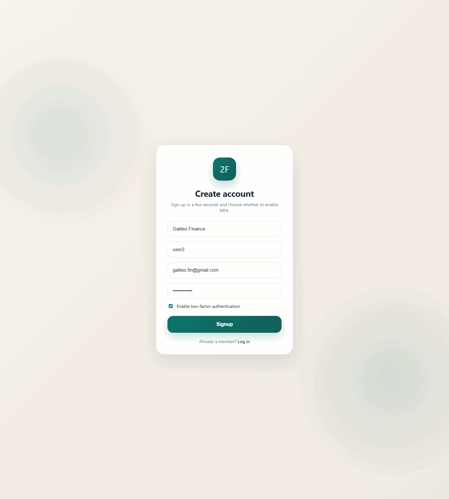
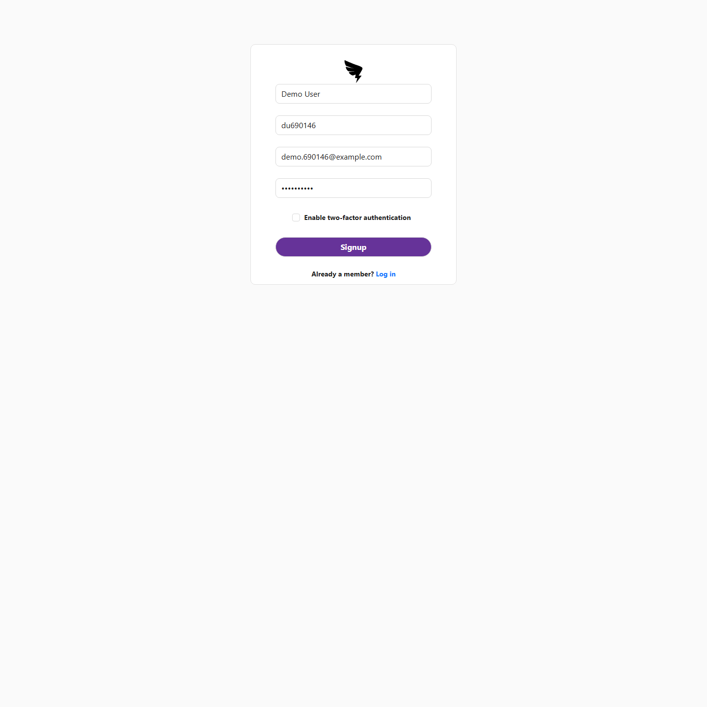
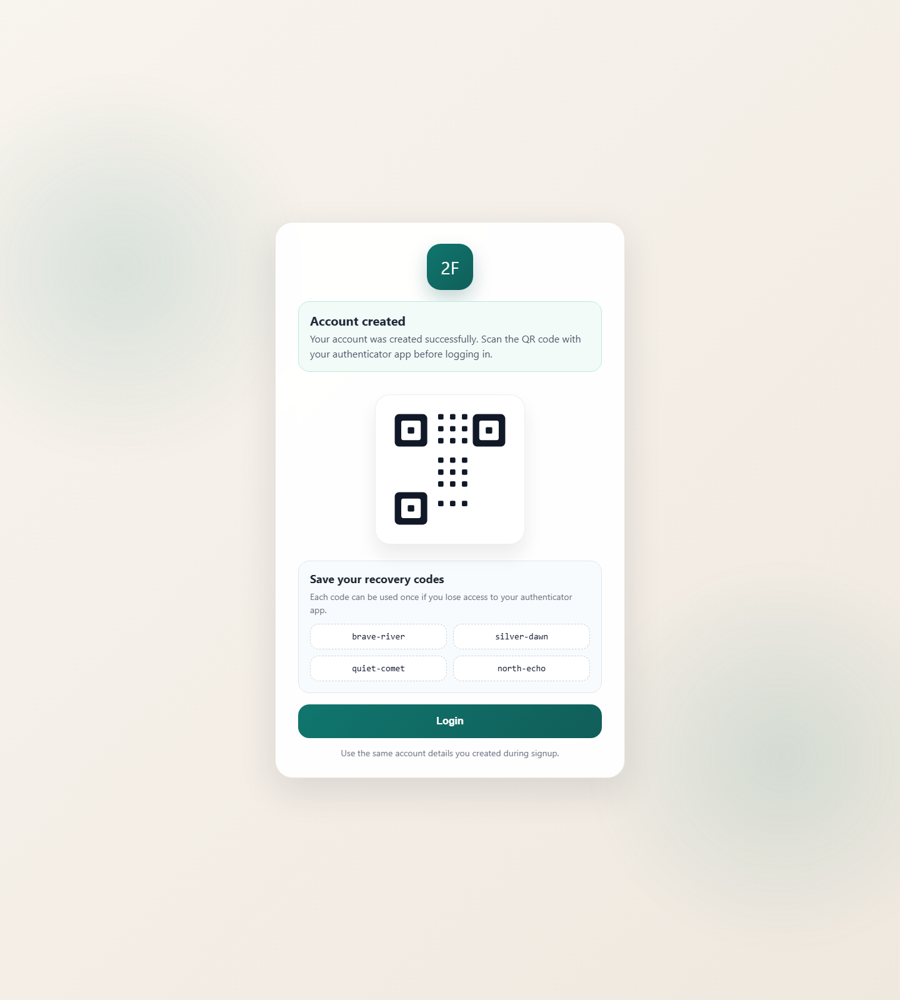
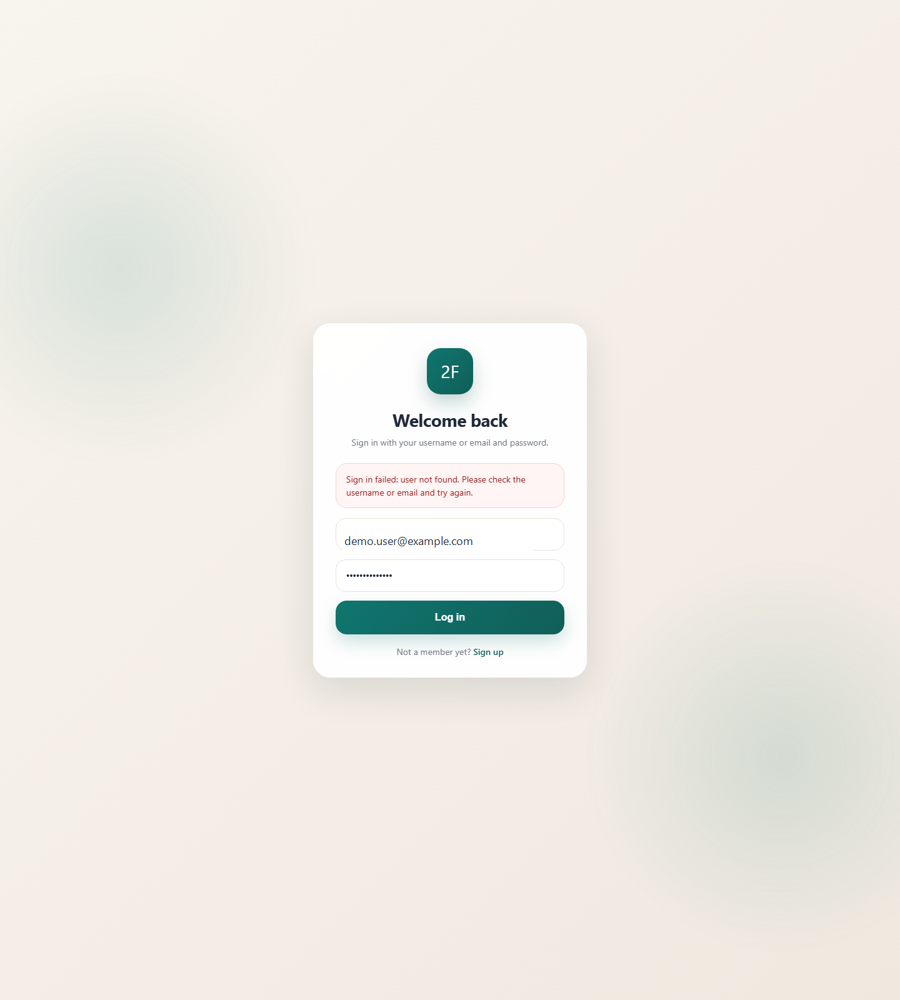
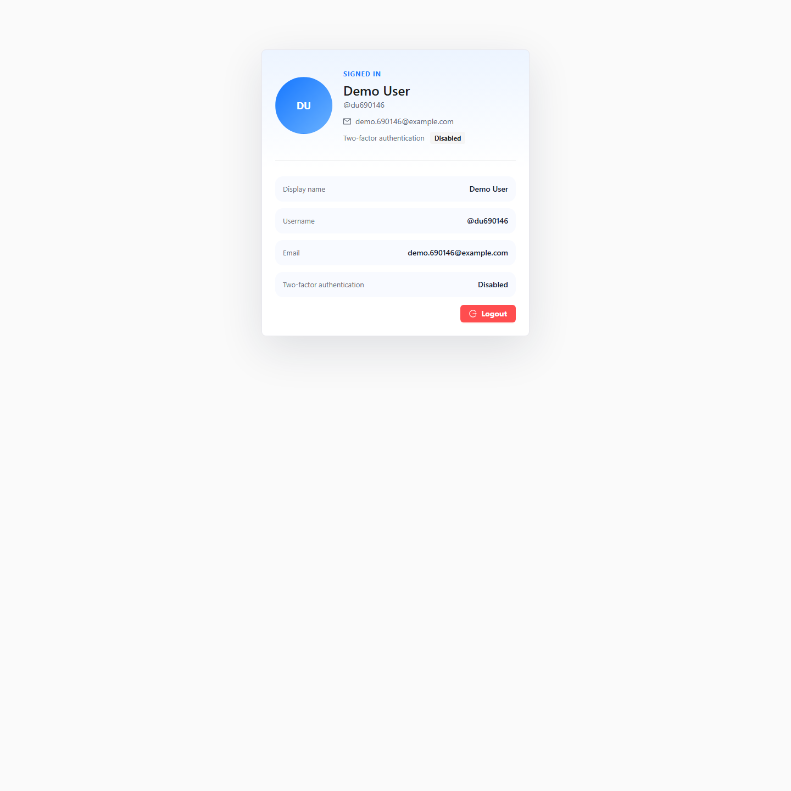
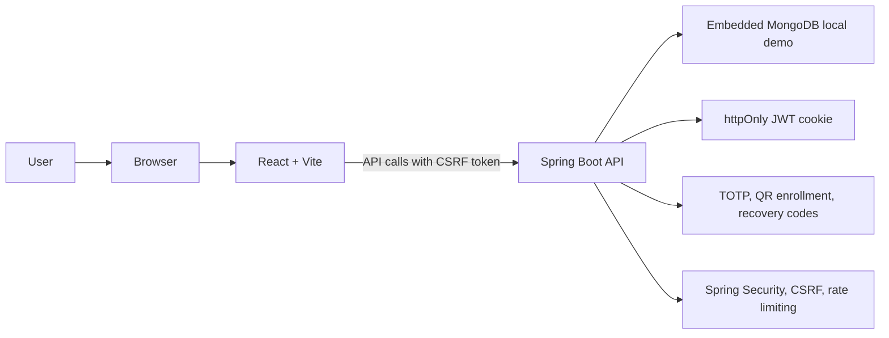
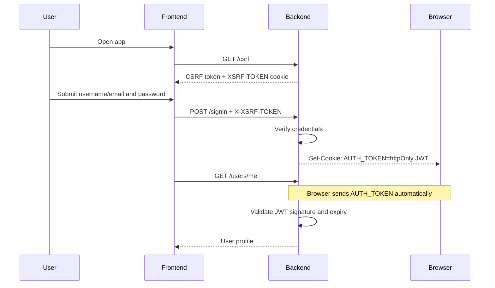
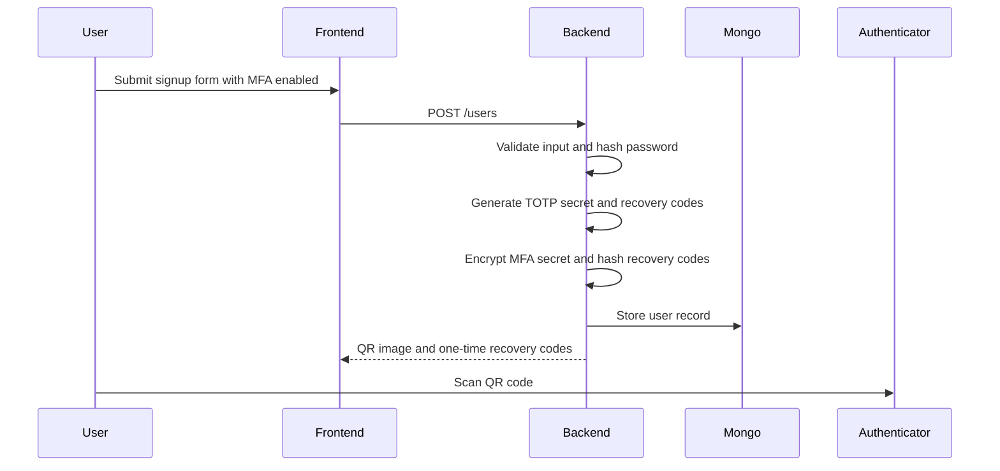
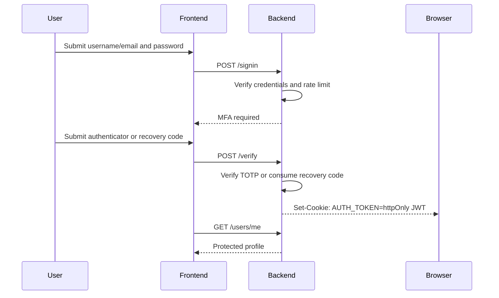
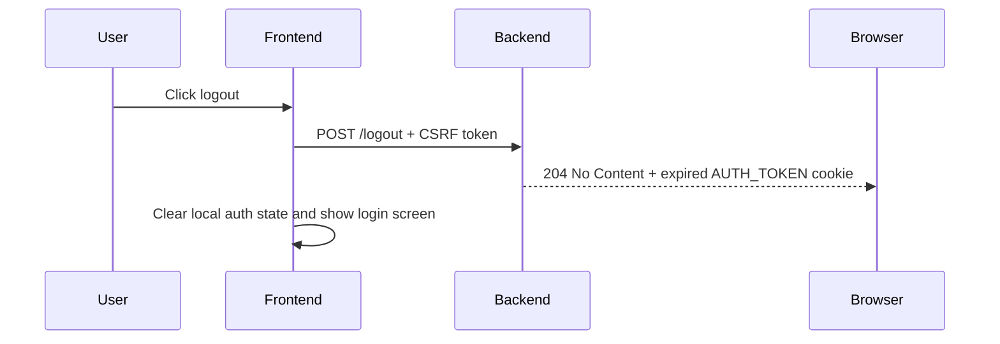

# 2-Factor Authentication Demo

A full-stack authentication demo for learning use. It demonstrates a browser-friendly signup and login flow with optional TOTP-based two-factor authentication, QR-code enrollment, recovery codes, CSRF protection, and JWT sessions stored in an `httpOnly` cookie.

## Preview



| Signup | MFA enrollment |
| --- | --- |
|  |  |
| Login | Profile |
|  |  |

## Key Terms

- Two-factor authentication (2FA): a login flow that requires two proofs, usually a password plus a one-time code.
- MFA: multi-factor authentication. In this project it means password login plus an optional TOTP verification step.
- TOTP: time-based one-time password, usually a 6-digit code that changes every few seconds.
- QR-code enrollment: the step where the app shows a QR code that links a user account to an authenticator app.
- Recovery code: a one-time backup code that can be used if the user loses access to the authenticator app.
- JWT-backed session: a signed token issued by the backend after login and stored in an `httpOnly` browser cookie.
- CSRF token: a browser security token required for state-changing requests when authentication uses cookies.

## What Is Implemented

- Signup with username, email, display name, password, and optional MFA.
- QR-code enrollment for TOTP-compatible authenticator apps.
- One-time recovery codes for MFA-enabled accounts.
- Login with username or email and password.
- MFA verification with either an authenticator code or an unused recovery code.
- BCrypt password hashing.
- Encrypted-at-rest MFA secrets for newly created MFA users.
- JWT sessions stored in `httpOnly` cookies so JavaScript cannot read the token directly.
- CSRF bootstrap and protected state-changing requests.
- Protected profile endpoint and profile screen.
- Logout by clearing the auth cookie without redirecting from the backend.
- User-friendly frontend validation and backend error responses.
- Backend request logging with request IDs.
- Backend unit, slice, and integration tests.
- Frontend component, flow, and API utility tests.

## MFA App

When MFA is enabled during signup, the app shows a QR code. Scan it with a TOTP-compatible authenticator app on your phone. The authenticator app then generates short 6-digit codes that change over time and are used as the second login step.

Common apps that work with this flow:

- Google Authenticator
- Microsoft Authenticator
- Authy
- 1Password
- Any other TOTP-compatible authenticator app

Basic flow:

1. Sign up with MFA enabled.
2. Scan the QR code with your authenticator app.
3. Save the recovery codes shown after signup.
4. Log in with username or email and password.
5. Enter the current authenticator code when prompted.

## Tech Stack

- Backend: Java 21+, Spring Boot 4.0.6, Spring Security, Spring Web, Spring Data MongoDB, Spring Validation, Spring Actuator, Maven.
- Security: BCrypt, JWT via `jjwt` 0.13.0, `httpOnly` cookies, CSRF tokens, security headers, in-memory auth rate limiting.
- MFA: TOTP and QR generation via `dev.samstevens.totp` 1.7.1, encrypted MFA secret storage, hashed recovery codes.
- Local persistence: embedded MongoDB via Flapdoodle 4.33.0 for local app runs, `mongo-java-server` 1.47.0 for tests.
- Frontend: React 19.2.7, Vite 8.0.16, React Router 7.16.0, Ant Design 6.4.3, Fetch API.
- Frontend quality: Jest 30.4.2, React Testing Library 16.3.2, ESLint 9.39.4.
- Scripts: Unix shell scripts for Linux, macOS, WSL, and Git Bash.

## Run Locally

This section is the path for a new user who has just cloned the project and wants to verify that everything works on their machine.

Prerequisites:

- Java 21 JDK or newer
- Node.js and npm
- Git Bash, WSL, Linux, or macOS shell for the `.sh` scripts

Check that the tools are available:

```sh
java -version
node -v
npm -v
```

Start from the project root:

1. Copy `backend/.env.example` to `backend/.env`.
2. Set `JWT_SECRET` in `backend/.env` to a long random value with at least 32 characters.
3. Optional: copy `frontend/.env.example` to `frontend/.env` if you want to change the backend URL.
4. Run backend verification: `./scripts/backend-verify.sh`
5. Run frontend verification: `./scripts/frontend-verify.sh`
6. Start the backend in one terminal: `./scripts/backend-run.sh`
7. Start the frontend in another terminal: `./scripts/frontend-run.sh`
8. Open `http://localhost:3000`.

Expected verification results:

- Backend verification ends with Maven `BUILD SUCCESS`.
- Backend unit tests run through Surefire.
- Backend integration tests run through Failsafe during `verify`.
- Frontend verification runs ESLint, Jest, and a Vite production build.

Root npm shortcuts:

- `npm run backend:verify`
- `npm run frontend:verify`
- `npm run verify`
- `npm run backend:run`
- `npm run frontend:run`

Docker is not required for the local demo workflow. The backend uses embedded MongoDB locally.

Important for Windows and WSL:

- Run scripts from Git Bash, WSL, Linux, or macOS.
- `frontend/node_modules` contains native packages and should not be shared between Windows/Git Bash and WSL.
- If dependencies were installed in a different shell or platform, delete `frontend/node_modules`, then run `npm ci` from the same environment you plan to use.
- For WSL, the most reliable setup is keeping the repo inside the WSL filesystem, for example `~/projects/2-factor-authentication-demo`.

## Troubleshooting

- If `8081` is already in use, stop the old backend process and start it again.
- If you hit `/login`, `/signup`, `/verify`, or `/qrcode` on the backend port by mistake, the backend redirects you to the frontend.
- If `/users/me` returns `401`, sign out, clear browser site data or cookies once, and sign in again.
- If frontend tests complain about missing packages, run `cd frontend && npm ci` from the same shell/environment you plan to use for the app.
- If frontend dev, test, or build scripts complain about a missing `rolldown` native binding, `node_modules` was probably installed for another platform.
- If WSL on `/mnt/c/...` fails with `EIO` while deleting Windows-native packages, delete `frontend/node_modules` from Windows File Explorer or PowerShell, then rerun `npm ci` from WSL.
- If the authenticator code fails, make sure the QR code was scanned into the authenticator app for the same user account.
- If embedded MongoDB fails to start in WSL, make sure your WSL distro is up to date and that the repo is not fighting Windows-native dependencies under `/mnt/c`.

## Demo Walkthrough

Before the walkthrough:

1. Run `./scripts/backend-verify.sh`.
2. Run `./scripts/frontend-verify.sh`.
3. Start the backend with `./scripts/backend-run.sh`.
4. Start the frontend with `./scripts/frontend-run.sh`.
5. Open `http://localhost:3000`.

Signup without MFA:

1. Open the signup page.
2. Create a user without MFA.
3. Confirm the success message appears.
4. Click `Login`.
5. Sign in with the new account.
6. Confirm the protected profile page loads.
7. Click `Logout`.

Signup with MFA:

1. Open the signup page.
2. Create a different user with MFA enabled.
3. Confirm the QR code and recovery codes are shown.
4. Scan the QR code with an authenticator app.
5. Click `Login`.
6. Sign in with username/email and password.
7. Enter the current authenticator code.
8. Confirm the protected profile page loads.
9. Click `Logout`.

Recovery code:

1. Sign in with the MFA-enabled account.
2. On the verification screen, enter one unused recovery code instead of an authenticator code.
3. Confirm the profile page loads.
4. Try the same recovery code again later and confirm it no longer works.

Error handling:

1. Try signing in with a wrong password.
2. Confirm the UI shows a friendly message.
3. Try an invalid MFA code.
4. Confirm the UI shows a friendly message.
5. Check backend logs for request-level messages with request IDs.

## Architecture

### Runtime Architecture



Responsibility split:

- Frontend: signup, login, MFA enrollment display, verification form, profile view, and user-friendly error messages.
- Backend: input validation, password hashing, MFA secret handling, recovery code handling, credential checks, JWT issuing, cookie handling, CSRF checks, rate limiting, and profile authorization.
- Browser: stores the auth cookie and sends it automatically on same-site API requests.
- Database: stores users, hashed passwords, MFA state, encrypted MFA secrets, and hashed recovery codes.

Security boundaries:

- Frontend routes are UX boundaries only.
- Backend authorization remains the real security boundary.
- JavaScript cannot read the JWT because it is stored in an `httpOnly` cookie.
- CSRF protection is required because cookie-backed credentials are sent automatically by the browser.
- Secrets and credentials should never be exposed through frontend state, logs, screenshots, or docs.

### Flows

Cookie-backed JWT flow:



Signup with MFA:



Login with MFA:



Logout flow:



### API Overview

| Method | Path | Purpose | Auth |
| --- | --- | --- | --- |
| `GET` | `/csrf` | Creates and returns the CSRF token used by frontend POST requests. | Public |
| `POST` | `/users` | Creates a user and returns MFA enrollment data when MFA is enabled. | Public + CSRF |
| `POST` | `/signin` | Verifies username/email and password. Returns MFA-required response or sets the auth cookie. | Public + CSRF |
| `POST` | `/verify` | Verifies an authenticator code or recovery code and sets the auth cookie. | Public + CSRF |
| `POST` | `/logout` | Clears the auth cookie and returns `204 No Content`. | Public + CSRF |
| `GET` | `/users/me` | Returns the current authenticated profile. | Cookie JWT |

### Test Structure

- Backend unit tests use `*Test`.
- Backend integration tests use `*IT` and run in Maven Failsafe during `verify`.
- Frontend tests run through the custom Jest runner used by `npm run test:ci`.
- Full frontend verification runs lint, tests, and production build through `npm run verify`.

### Repository Structure

```text
.
+-- backend
|   +-- src/main/java/com/github/leoyakubov/twofactorauth
|   |   +-- config
|   |   +-- controller
|   |   +-- exception
|   |   +-- model
|   |   +-- payload
|   |   +-- repository
|   |   +-- service
|   +-- src/main/resources
|   +-- src/test/java
+-- frontend
|   +-- src
|   |   +-- profile
|   |   +-- qrcode
|   |   +-- shared
|   |   +-- signin
|   |   +-- signup
|   |   +-- verifycode
|   +-- test
+-- docs
+-- scripts
```

## Limitations

- This is a demo project, not a production-ready identity platform.
- Local development runs over HTTP; production use should enforce HTTPS and secure cookie settings.
- MFA secrets are encrypted before storage, but production systems should use managed key storage and rotation.
- Rate limiting is in-memory, so counters reset when the backend restarts.
- Password reset, email verification, and self-service account recovery are not implemented.
- Embedded MongoDB is convenient locally, but production deployments should use a managed or separately operated MongoDB instance.
- Access and refresh token rotation is not implemented.
- Recovery codes are shown once during signup; there is no UI for regenerating them.

## Security

This project implements a realistic local authentication flow, but it is still a demo. The notes below separate what is already handled from what would need hardening before a real deployment.

Current security posture:

- Passwords are hashed with BCrypt before storage.
- JWTs are stored in `httpOnly` cookies instead of `localStorage`.
- State-changing browser requests use CSRF tokens.
- MFA secrets generated for new MFA users are encrypted before storage.
- Recovery codes are stored as hashes and are consumed after use.
- Repeated signup, signin, and MFA verification attempts are rate limited in memory.
- Backend routes remain the authorization boundary; frontend routing is only a user experience layer.
- Security headers are configured through Spring properties, including Content Security Policy.

Security concerns and possible solutions:

- Cookie-backed JWTs reduce token exposure to JavaScript, but injected scripts could still make authenticated requests from the page.
  Possible solution: keep React output escaping, avoid unsafe HTML, keep dependencies updated, and keep the Content Security Policy strict.
- CSRF protection is required because cookies are sent automatically by the browser.
  Possible solution: keep the `/csrf` bootstrap flow, require the `X-XSRF-TOKEN` header for state-changing requests, and review any future public POST endpoints carefully.
- Local HTTP is acceptable for development, but credentials and cookies must be protected in deployed environments.
  Possible solution: enforce HTTPS outside local development and enable secure cookie settings in deployment profiles.
- MFA secrets are encrypted before storage, but the encryption key still needs production-grade management.
  Possible solution: store keys in a secret manager or vault, restrict access, rotate keys carefully, and expose QR enrollment data only during setup.
- The JWT secret must remain private and rotated over time.
  Possible solution: load it from managed secrets, rotate it periodically, and never commit real secret values.
- In-memory rate limiting is useful locally but does not protect a multi-instance deployment.
  Possible solution: move rate-limit counters to Redis or another shared store and add edge-layer protection.
- Recovery codes are one-time use, but there is no regeneration or recovery workflow yet.
  Possible solution: add authenticated recovery-code regeneration, password reset, email verification, and a documented lost-MFA flow.
- Embedded MongoDB makes the demo easy to run, but it is not a production database setup.
  Possible solution: use a managed or separately operated MongoDB deployment with backups, monitoring, access controls, and network restrictions.

Hardening roadmap:

1. Add deployment profiles for HTTPS, secure cookies, production CORS origins, and external MongoDB.
2. Move secrets and encryption keys to a managed secret store.
3. Add password reset, email verification, and recovery-code regeneration flows.
4. Replace in-memory rate limiting with shared persistent counters.
5. Add refresh token rotation or a clearer short-lived session strategy.
6. Add production observability guidance for auth failures, lockouts, and suspicious activity.
