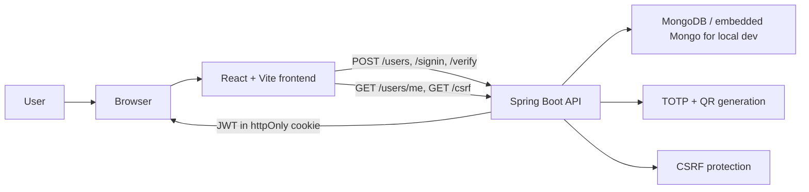

# two-factor-authentication-demo

A full-stack demo that shows username/password sign-up and login with optional two-factor authentication, QR-code enrollment, TOTP verification, and JWT-backed browser sessions using an `httpOnly` cookie.

## Preview

_Signup, MFA enrollment, login, and protected profile access in one short walkthrough._

| Signup | MFA enrollment |
| --- | --- |
|  |  |
| Login | Profile |
|  |  |

## Table Of Contents

- [Project Snapshot](#project-snapshot)
- [What Is Implemented](#what-is-implemented)
- [Architecture](#architecture)
- [Demo Media](#demo-media)
- [Portfolio Summary](#portfolio-summary)
- [Why This Project](#why-this-project)
- [Quick Start](#quick-start)
- [Testing](#testing)
- [Docs](#docs)
- [Project Status](#project-status)

## Project Snapshot

- Backend: Java 21, Spring Boot 4.0.6, Spring Security, MongoDB
- Frontend: React 19.2.7, Vite 8.0.16, React Router 7.16.0, Ant Design 6.4.3
- Testing: JUnit 5, Mockito, Jest 30.4.2, React Testing Library 16.3.2
- Auth: JWT in `httpOnly` cookies with CSRF protection
- MFA: TOTP with QR-code enrollment and recovery codes
- Data: MongoDB for local development

## What Is Implemented

- Sign up with username, email, password, display name, and optional MFA
- QR-code enrollment for authenticator apps
- TOTP verification during login
- One-time recovery codes for MFA-enabled accounts
- JWT-backed session access through an `httpOnly` cookie
- CSRF protection for state-changing requests
- Rate limiting for sign-in, sign-up, and MFA verification
- Logout by clearing the session cookie
- Backend and frontend tests

## Architecture

The frontend keeps the UI and auth flow lightweight, while the backend owns the security-sensitive parts:

- credential validation
- MFA enrollment and verification
- JWT issuance and cookie handling
- CSRF protection
- rate limiting

## Demo Media

Recommended screenshots or a short GIF for GitHub or interview use:

- signup screen with the MFA option visible
- QR enrollment screen with the generated code
- login flow showing the MFA verification step
- profile page with the avatar and logout button

See [`docs/demo-media.md`](docs/demo-media.md) for a small capture checklist.

## Portfolio Summary

GitHub repo description:

> Full-stack Spring Boot and React demo with optional TOTP-based MFA, QR enrollment, JWT-backed `httpOnly` cookie sessions, CSRF protection, and rate limiting.

CV bullets:

- Built a full-stack authentication demo with optional MFA, QR enrollment, JWT cookie sessions, CSRF protection, and rate limiting using Spring Boot, React, and MongoDB.
- Added recovery codes and security hardening to move the project beyond a basic tutorial implementation.
- Organized the repo with a clean README, supporting docs, and a guided demo flow for interviews and portfolio review.

## Why This Project

This project was built to demonstrate:

- a realistic full-stack auth flow
- a browser-friendly MFA experience
- practical Spring Boot and React architecture
- security tradeoffs and hardening decisions
- a repo that is easy to run and present in an interview

## Quick Start

1. Copy `backend/.env.example` to `backend/.env` and set `JWT_SECRET` to a long random string.
2. Copy `frontend/.env.example` to `frontend/.env` if you want to override the API URL.
3. Run backend unit and slice tests: `./scripts/test-backend.sh`
4. Run the full backend verification flow, including integration tests: `./scripts/verify-backend.sh`
5. Run frontend unit/component tests: `./scripts/test-frontend.sh`
6. Build the frontend production bundle: `./scripts/build-frontend.sh`
7. Start the backend: `./scripts/run-backend.sh`
8. Start the frontend: `./scripts/run-frontend.sh`
9. Open the app and walk through signup, MFA enrollment, login, and profile access.

## Testing

The test split is intentionally simple:

- Backend unit and slice tests run with `./scripts/test-backend.sh`
- Backend integration tests run with `./scripts/verify-backend.sh`
- Frontend component and utility tests run with `./scripts/test-frontend.sh`
- Frontend production build checks run with `./scripts/build-frontend.sh`

Backend integration tests use embedded Mongo, so you do not need Docker for the demo workflow.

## Docs

- [Technical guide](docs/technical-guide.md)
- [Demo media checklist](docs/demo-media.md)
- [Security guide](docs/security-guide.md)
- [Full verification workflow](docs/verification-workflow.md)
- [Troubleshooting](docs/troubleshooting.md)

## Project Status

The app is demo-ready and the latest work focused on security hardening, documentation cleanup, and presentation polish.
