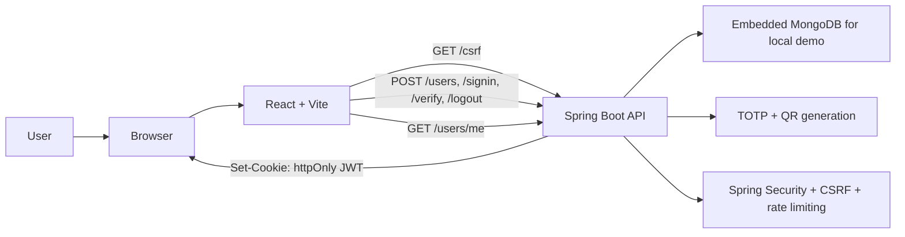

# 2-Factor Authentication Demo

A full-stack authentication demo built for portfolio, interview, and learning use. It demonstrates a browser-friendly signup and login flow with optional TOTP-based two-factor authentication, QR-code enrollment, recovery codes, CSRF protection, and JWT sessions stored in an `httpOnly` cookie.

## Preview

| Signup | MFA enrollment |
| --- | --- |
|  |  |
| Login | Profile |
|  |  |

## Tech Stack

- Backend: Java 21+, Spring Boot 4.0.6, Spring Security, Spring Data MongoDB, Maven
- Frontend: React 19.2.7, Vite 8.0.16, React Router 7.16.0, Ant Design 6.4.3
- Authentication: BCrypt password hashing, JWT in `httpOnly` cookies, CSRF token flow
- MFA: TOTP authenticator codes, QR enrollment, one-time recovery codes
- Testing and quality: JUnit 5, Mockito, embedded Mongo integration tests, Jest 30.4.2, React Testing Library 16.3.2, ESLint

## What Is Implemented

- User signup with username, email, display name, password, and optional MFA
- QR-code enrollment for authenticator apps
- Login with username or email and password
- MFA verification with an authenticator code or one-time recovery code
- Encrypted-at-rest MFA secrets for newly created MFA users
- JWT-backed browser session stored in an `httpOnly` cookie
- CSRF bootstrap and protected state-changing requests
- Protected profile page loaded from the backend
- Logout by clearing the auth cookie
- User-friendly frontend validation and error messages
- Backend request logging with request IDs
- Backend unit, slice, and integration tests
- Frontend component and API utility tests

## Architecture

The frontend owns the user experience. The backend owns credentials, password hashing, MFA secrets, token issuing, cookie handling, CSRF checks, rate limiting, and protected profile access.

## Quick Start

Prerequisites for a new machine:

- Java 21 JDK or newer
- Node.js and npm
- Git Bash, WSL, Linux, or macOS shell for the `.sh` scripts

Run locally:

1. Clone the repo and open the project root.
2. Copy `backend/.env.example` to `backend/.env`.
3. Set `JWT_SECRET` in `backend/.env` to a long random value with at least 32 characters.
4. Optional: copy `frontend/.env.example` to `frontend/.env` if you want to change the backend URL.
5. Verify the backend: `./scripts/backend-verify.sh`
6. Verify the frontend: `./scripts/frontend-verify.sh`
7. Start the backend: `./scripts/backend-run.sh`
8. Start the frontend: `./scripts/frontend-run.sh`
9. Open `http://localhost:3000` and walk through signup, MFA enrollment, login, and profile access.

Docker is not required for the local demo workflow. The backend uses embedded MongoDB for local development and integration tests.

You can also use root npm shortcuts:

- `npm run backend:verify`
- `npm run frontend:verify`
- `npm run verify`

## Limitations

- This is a demo project, not a production-ready identity platform.
- Local development runs over HTTP; production use should enforce HTTPS and secure deployment defaults.
- MFA secrets are encrypted before storage, but a production system should still use stronger key management and rotation.
- Rate limiting is in-memory, so it resets when the backend restarts.
- Password reset, email verification, and account recovery flows are not implemented.
- Embedded MongoDB is convenient for local demos, but production deployments should use managed or separately operated MongoDB.

## More Details

- [Technical guide](docs/technical-guide.md)
- [Architecture details](docs/architecture.md)
- [Demo script](docs/demo-script.md)
- [Security guide](docs/security-guide.md)
- [Verification workflow](docs/verification-workflow.md)
- [Troubleshooting](docs/troubleshooting.md)
- [Demo media checklist](docs/demo-media.md)
- [Portfolio notes](docs/portfolio-notes.md)
