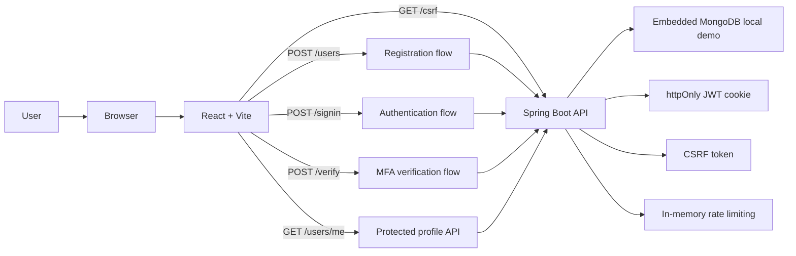
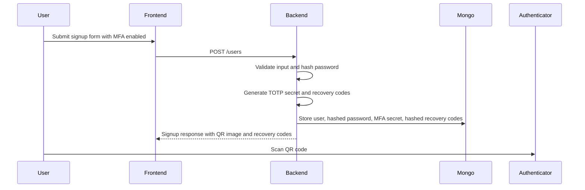
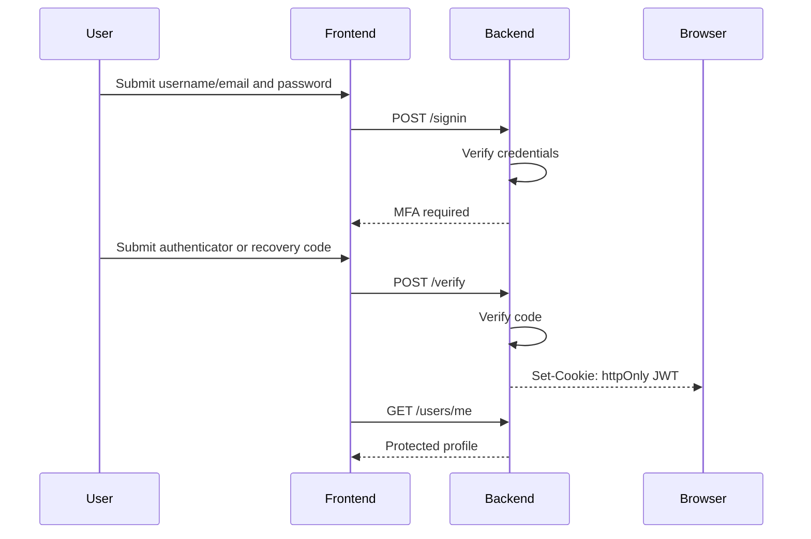

# Architecture

This project uses a small full-stack architecture where the frontend owns the user journey and the backend owns security-sensitive behavior.

## Runtime Overview

## Signup With MFA

## Login With MFA

## Security Boundaries

- The browser stores the JWT in an `httpOnly` cookie, so JavaScript cannot read the token directly.
- CSRF protection is required because cookie-backed credentials are sent automatically by the browser.
- The backend validates credentials, MFA codes, recovery codes, JWT signatures, and profile access.
- Frontend routes are UX boundaries only; backend routes remain the real authorization boundary.
