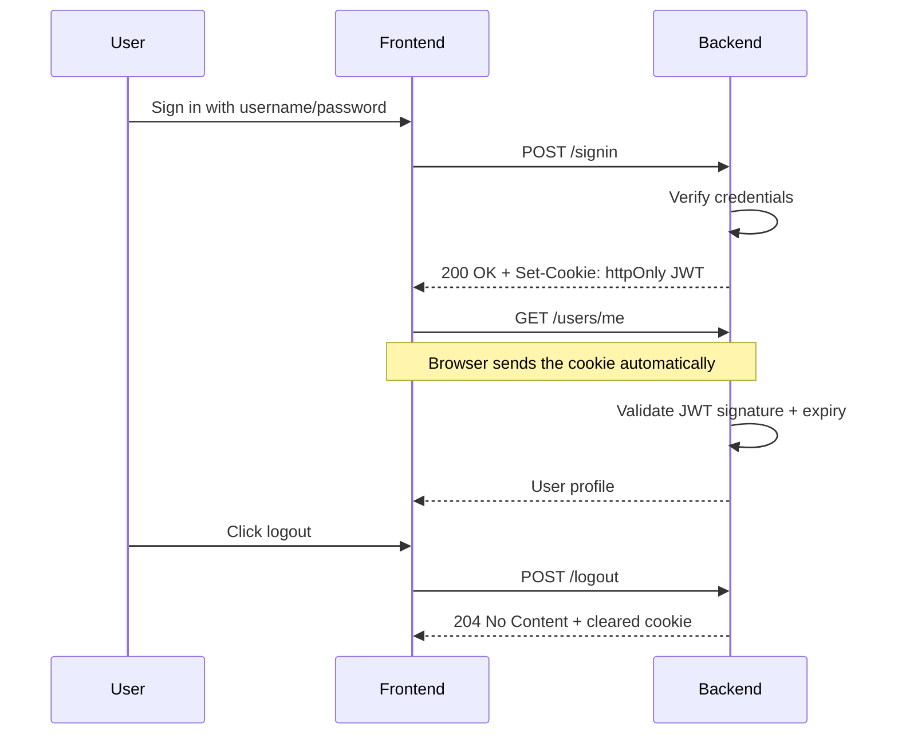

# Technical Guide

## Project Intent

This repo demonstrates a simple auth flow with:

- registration with or without MFA
- QR-code based authenticator enrollment
- login plus OTP verification when MFA is enabled
- JWT-protected profile access

It is intentionally demo-focused rather than production hardened, but it is structured so it is easy to understand, run, and extend.

## Key Terms

- Two-factor authentication (2FA): a login flow that asks for two kinds of proof, usually a password plus a one-time code from an authenticator app
- QR-code enrollment: the step where the app shows a QR code that links your account to an authenticator app
- TOTP: time-based one-time password, meaning a 6-digit code that changes every few seconds
- JWT-backed session access: after login, the backend stores a signed token in an `httpOnly` cookie and the browser sends it automatically on future requests

## What Is Implemented

- Sign up with username, email, password, display name, and optional MFA
- Generate a QR code when MFA is enabled during signup
- Store the MFA secret on the backend for the user account
- Log in with username or email plus password
- Require a second step when MFA is enabled
- Verify the 6-digit authenticator code on the backend
- Issue one-time recovery codes for MFA-enabled accounts
- Return a signed JWT after successful login or MFA verification
- Store the JWT in an `httpOnly` cookie instead of JavaScript-readable storage
- Bootstrap and send CSRF tokens automatically for state-changing requests
- Rate limit repeated sign-in, sign-up, and MFA verification attempts
- Use the cookie-backed JWT to load the protected profile page
- Support logout by clearing the session cookie

## MFA App

When MFA is enabled, the app shows a QR code during signup. That QR code is scanned by an authenticator app on your phone.

What it is:

- An authenticator app generates short, time-based 6-digit codes
- Those codes change every few seconds and are used as the second login factor

Where to get one:

- Google Authenticator
- Microsoft Authenticator
- Authy
- 1Password or any other TOTP-compatible authenticator app

How to use it:

1. Sign up with MFA enabled.
2. Open your authenticator app and add a new account.
3. Scan the QR code with your phone camera.
4. The app will start showing 6-digit codes.
5. Enter the current code on the login verification screen when prompted.

If MFA is disabled for the account, the login flow skips the QR code and verification step.

When MFA is enabled, the signup screen also shows one-time recovery codes. Each code can be used once if you lose access to your authenticator app.

## API Overview

- `POST /users` creates a new user and returns the MFA QR code when MFA is enabled
- `POST /signin` checks username/email plus password and returns a JWT or MFA-required response
- `POST /verify` checks the 6-digit authenticator code and returns a JWT
- `GET /csrf` initializes the CSRF cookie used by the frontend for POST requests
- `GET /users/me` returns the current authenticated user profile

## Auth Flow

The demo uses a cookie-backed JWT flow for browser sessions:

What this means:

- The backend still stays stateless
- The browser keeps the token in an `httpOnly` cookie
- JavaScript cannot read the JWT directly
- The frontend only checks whether the current cookie-backed session is valid

## Tech Stack

Backend:

- Java 21
- Spring Boot 3.5.14
- Spring Security
- Spring Web
- Spring Data MongoDB
- Embedded MongoDB via Flapdoodle
- JWT via `jjwt`
- TOTP / QR generation via `dev.samstevens.totp`

Frontend:

- React 19.1.1
- Vite
- Jest
- React Router v5
- Ant Design
- Fetch API

Tooling:

- Maven Wrapper
- npm
- PowerShell scripts for Windows
- shell scripts for Unix/macOS

## Repository Layout

- `backend`: Spring Boot API
- `frontend`: React client
- `scripts`: helper scripts for running and testing

